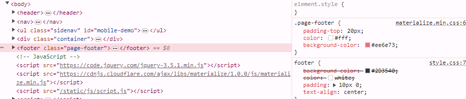
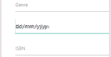
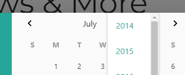
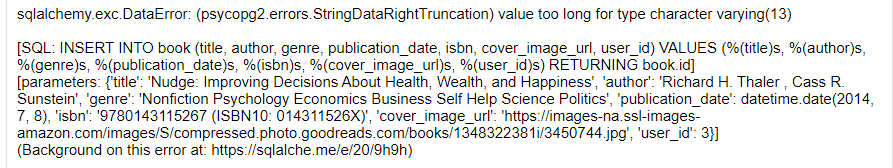
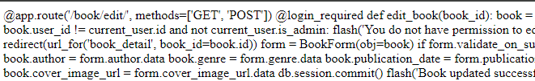
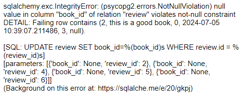
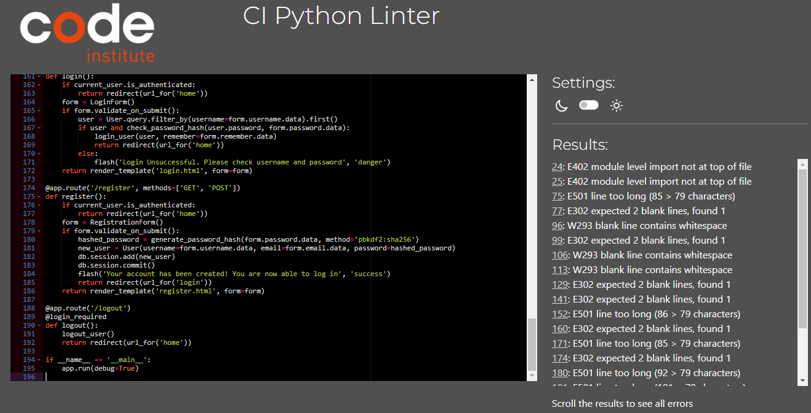
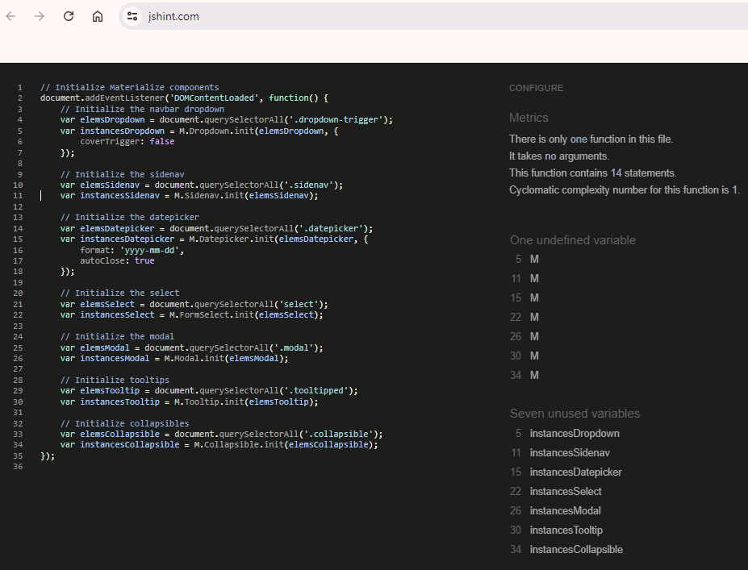

# Testing Approach:

A combination of manual and potentially automated testing will be used.
Manual testing will focus on user interaction scenarios and overall user experience.
Automated testing (optional) can be implemented for data validation and basic functionalities.

## Test Cases:

### 1. User Functionality
| Test Case ID	| Description	| Expected Result	| Pass/Fail	| Notes |
| ----------- | ----------- | ----------- | ----------- | ----------- |
| TC-01	|	User can create a new book entry with valid data (title, author, cover image URL)	|	Book entry is successfully created and displayed in the list.	|	Pass |	No need to be registered |
| TC-02	|	User cannot create a new book entry with missing required data (e.g., title)	|	Error message is displayed indicating missing information.	|	Pass |	Mandatory fields are Book name and Author |
| TC-03	|	User can edit an existing book entry with updated details.	|	Updated book information is reflected in the list and individual book page.	|	Pass |	This is now fixed after restoring page from Github. |
| TC-04	|	User cannot edit a book entry with invalid data.	|	Error message is displayed indicating invalid information.	|	Fail |	User attempting to edit crashes page |
| TC-05	|	User can delete a book entry.	| Book entry is removed from the list and database.	| Pass	|	After confirming with facilitator, modal implemented for confirmation on delete. Users can only delete books they added. |
| TC-06	|	User can write a review for an existing book.	|	Review is saved and displayed on the book's page.	|	Pass |	Registered users can write reviews. |
| TC-07	|	User cannot submit a review with missing content.	|	Error message is displayed indicating missing information.	|	Pass |	Blank reviews cause alert message. |
| TC-08	|	User can edit an existing review.	|	Updated review content is reflected on the book's page.	|	Pass |	User allowed to delete own review when logged in. |
| TC-09	|	User can upvote a review.	| Review upvote count is incremented.	| Postponed	|	Implementation delayed for next revision.	|

### 2. Data Manipulation
| Test Case ID	| Description	| Expected Result	| Pass/Fail	| Notes |
| ----------- | ----------- | ----------- | ----------- | ----------- |
| TC-10	|	Database successfully stores new book entries with all relevant fields.	|	Book data is retrievable from the database.	|	Pass |	Book data stored as planned. |
| TC-11	|	Database updates book information when an entry is edited.	|	Updated data is reflected in the database.	|	Pass |	This is now fixed after restoring page from Github. |
| TC-12	|	Database deletes book entry upon user request.	|	Entry is removed from the database.	|	Pass |	Book deletes only by admin at the moment. |
| TC-13	|	Database successfully stores user reviews for books.	|	Review data is retrievable and associated with the corresponding book.	|	Pass |	Reviews are stored. |
| TC-14	|	Database updates review content when edited by the user.	|	Updated review content is reflected in the database.	|	Pass |	This is now fixed after restoring page from Github. |
| TC-15	|	Database accurately maintains review upvote count.	|	Upvote count reflects the number of users who upvoted the review.	|	Postponed |	Not implemented |

### 3. User Interface
| Test Case ID	| Description	| Expected Result	| Pass/Fail	| Notes |
| ----------- | ----------- | ----------- | ----------- | ----------- |
| TC-16	|	Website displays a clear layout with navigation menu for easy access to different functionalities.	|	Navigation menu allows users to browse books, add new entries, write reviews, etc.	|	Pass |	Navigation working as planned |	
| TC-17	|	User can search for books by title (and potentially other criteria).	|	Search results display books matching the search terms.	| Update	|	Search not implemented, browse only.	|
| TC-18	|	Individual book pages display relevant information (title, author, cover image, reviews).	|	Book details are presented clearly and visually appealing.	|	Pass |	Book display as planned. |
| TC-19	|	User input forms (add book, write review) are clear and easy to use.	|	Input fields are labeled appropriately, and validation messages guide the user.	|	Pass |	Fields are clear and messages are clear. |		
| TC-20	|	Website is responsive and displays well on different screen sizes (desktop, mobile).	|	Layout adapts to different screen resolutions for optimal user experience.	| Pass	|		Materialize used throughout and working.	|

## Problem Tracker:
### 1.
    - Unable to load models to the database.
    - Unable to use form from forms.py
        - turns out the files is in the wrong folder and should be like this instead:

        project_root/
        │
        ├── app.py
        ├── create_tables.py  # Script to create the tables initially
        ├── models.py         # Contains the SQLAlchemy models
        ├── forms.py          # Contains the WTForms forms
        ├── requirements.txt  # Lists project dependencies
        ├── static/
        │   ├── css/
        │   │   ├── materialize.min.css
        │   │   └── style.css
        │   └── js/
        │       └── script.js
        ├── templates/
        │   ├── base.html
        │   ├── books.html
        │   ├── add_book.html
        │   ├── book_detail.html
        │   ├── edit_book.html
        │   ├── login.html
        │   └── register.html
        └── data/
            └── data.json

### 2.
When running the python app the following errors appear in the terminal:
        "LoginForm" is not defined [Ln 97, Col 12]
        "RegistrationForm" is not defined [Ln 111, Col 12]

when running the python app the following errors appear as a BuildError:
        werkzeug.routing.exceptions.BuildError: Could not build url for endpoint 'add_book'. Did you mean 'edit_book' instead?
        File "c:\Users\jande\OneDrive\Documents\GitHub\CodInstProj3\app.py", line 31, in home
        return render_template('index.html')
        
        File "c:\Users\jande\OneDrive\Documents\GitHub\CodInstProj3\templates\index.html", line 1, in top-level template code
        
        
        File "c:\Users\jande\OneDrive\Documents\GitHub\CodInstProj3\templates\base.html", line 34, in top-level template code
        <li><a href="{{ url_for('add_book') }}">Add Book</a></li>

 - **Correction**
    -   Define the route for add_book.html in the app.py file.

    -   Check that BookForm, ReviewForm, LoginForm, and RegistrationForm are imported from forms.py
        -   from forms import BookForm, ReviewForm, LoginForm, RegistrationForm

### 3.
when logging in with an existing user the following error:
Exception: Install 'email_validator' for email validation support.
File "c:\Users\jande\OneDrive\Documents\GitHub\CodInstProj3\app.py", line 117, in login
@app.route('/login', methods=['GET', 'POST'])
def login():
    if current_user.is_authenticated:
        return redirect(url_for('home'))
    form = LoginForm()
    if form.validate_on_submit():

    -   Update RegistrationForm to make email non-mandatory.
    -   Update LoginForm to use username instead of email.
    -   Update the registration route to handle non-mandatory email.
    -   Update the login route to authenticate using username.

### 4.
when adding a new book, without adding the publication date an internal server error appears without adding the data to the database. sqlalchemy.exc.DataError: (psycopg2.errors.InvalidDatetimeFormat) invalid input syntax for type date:

        -   Adding a date prevents the error
        -   Change the 'BookForm' 
            -   Previous: publication_date = StringField('Publication Date')
            -   Current: publication_date = DateField('Publication Date', format='%Y-%m-%d', validators=[Optional()])
            -   Change "class Book(db.Model)" to allow nullable date

### 5.
Footer color is overwridden by default materialize color.  
      
    -   Added !important to some styles to force them to apply over Materialize defaults.  

### 6.
The date field text for add_book overlays the date selector and filed name.  
      
    -   fix .datepicker modal from Materialize in add_book.html and script.js  

### 7.
when logged on as a user there is no option to delete my own review.  
When logged in as admin user ('code_admin') there is no option to delete any reviews or books.  
    -   Add routes to app.py  
        -   @app.route('/review/delete/<int:review_id>', methods=['POST'])  
        -   @app.route('/book/delete/<int:book_id>', methods=['POST'])  
    -   Add a delete button for reviews in book_detail.html  
    -   Delete from books.html not added, deletion from book_detail sufficient.  

### 8.
User is not able to 'Update' entries.  
    -   route for edit_book fixed  
    -   new edit_review page added and linked  

### 9.
When adding a book, the year selection only goes back to 2014.  
      
    -   yearRange	Number || Array	10	Number of years either side, or array of upper/lower range.  
        - .datepicker default is being used. Will NOT be updated as date can be manually changed.  

### 10.
When adding a book, if republished with multiple ISBN, the field is too small.  
      
    -   Models.py contains isbn = db.Column(db.String(13))
        -   will NOT be updated for multiple ISBN usage at this stage.  
            -   This is now updated to 50 characters.  

### 11.  
When editing a book, clicking the edit button causes an error.  
      
    -   Restore edit_book.html from backup and update.  

### 12.  
No confirmation on deletion.  
    -   Modal implemented to fonfirm on deletion.  
        -   Users can delete books they added. Admin can delete all books.  

### 13.  
When deleting a book with an associated reviews the following error appears.  
      
    -   the foreign key constraint on the 'review' table prevents the 'book_id' column from being set to NULL.  
        -   Update model.py with 'cascade="all, delete-orphan"'.  
        -   Update database by pushing model update.  

## Code Validation

### Python
Python file `app.py` was validated using the [Code Institute Python Linter](https://pep8ci.herokuapp.com/).  
  

<em>Figure: Pre-correction CI Python Linter Result</em>

  

<em>Figure: Corrected CI Python Linter Result</em>

### JavaScript
JavaScript file `script.js` was validated using [JSHint v2.13](https://jshint.com/).  

<em>Figure: JavaScript Validation Result</em>

## Lighthouse Testing
The [Lighthouse](https://developer.chrome.com/docs/lighthouse/overview/) tool in Google Chrome was used to test site performance, accessibility and best practice.

| *PAGE* | *RESULT* | *REPORT* |
| :--- | :---: | :---: |
