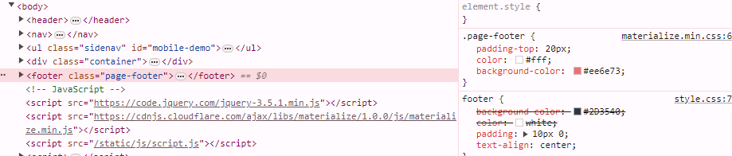
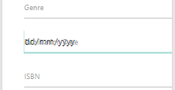

# Testing Approach:

A combination of manual and potentially automated testing will be used.
Manual testing will focus on user interaction scenarios and overall user experience.
Automated testing (optional) can be implemented for data validation and basic functionalities.

## Test Cases:

### 1. User Functionality
| Test Case ID	| Description	| Expected Result	| Pass/Fail	| Notes |
| ----------- | ----------- | ----------- | ----------- | ----------- |
| TC-01	|	User can create a new book entry with valid data (title, author, cover image URL)	|	Book entry is successfully created and displayed in the list.	|	x |	x |
| TC-02	|	User cannot create a new book entry with missing required data (e.g., title)	|	Error message is displayed indicating missing information.	|	x |	x |
| TC-03	|	User can edit an existing book entry with updated details.	|	Updated book information is reflected in the list and individual book page.	|	x |	x |
| TC-04	|	User cannot edit a book entry with invalid data.	|	Error message is displayed indicating invalid information.	|	x |	x |
| TC-05	|	User can delete a book entry.	| Book entry is removed from the list and database.	|	|	Confirmation message can be considered (optional). |
| TC-06	|	User can write a review for an existing book.	|	Review is saved and displayed on the book's page.	|	x |	x |
| TC-07	|	User cannot submit a review with missing content.	|	Error message is displayed indicating missing information.	|	x |	x |
| TC-08	|	User can edit an existing review.	|	Updated review content is reflected on the book's page.	|	x |	x |
| TC-09	|	User can upvote a review.	| Review upvote count is incremented.	| 	|	Visual indication of upvote (e.g., highlighted button) can be considered.	|

### 2. Data Manipulation
| Test Case ID	| Description	| Expected Result	| Pass/Fail	| Notes |
| ----------- | ----------- | ----------- | ----------- | ----------- |
| TC-10	|	Database successfully stores new book entries with all relevant fields.	|	Book data is retrievable from the database.	|	x |	x |
| TC-11	|	Database updates book information when an entry is edited.	|	Updated data is reflected in the database.	|	x |	x |
| TC-12	|	Database deletes book entry upon user request.	|	Entry is removed from the database.	|	x |	x |
| TC-13	|	Database successfully stores user reviews for books.	|	Review data is retrievable and associated with the corresponding book.	|	x |	x |
| TC-14	|	Database updates review content when edited by the user.	|	Updated review content is reflected in the database.	|	x |	x |
| TC-15	|	Database accurately maintains review upvote count.	|	Upvote count reflects the number of users who upvoted the review.	|	x |	x |

### 3. User Interface
| Test Case ID	| Description	| Expected Result	| Pass/Fail	| Notes |
| ----------- | ----------- | ----------- | ----------- | ----------- |
| TC-16	|	Website displays a clear layout with navigation menu for easy access to different functionalities.	|	Navigation menu allows users to browse books, add new entries, write reviews, etc.	|	x |	
| TC-17	|	User can search for books by title (and potentially other criteria).	|	Search results display books matching the search terms.	|	|		Implement filtering options as needed.
| TC-18	|	Individual book pages display relevant information (title, author, cover image, reviews).	|	Book details are presented clearly and visually appealing.	|	x |	x |
| TC-19	|	User input forms (add book, write review) are clear and easy to use.	|	Input fields are labeled appropriately, and validation messages guide the user.	|	x |	x |		
| TC-20	|	Website is responsive and displays well on different screen sizes (desktop, mobile).	|	Layout adapts to different screen resolutions for optimal user experience.	|	|		Consider using responsive design techniques.	|

Tables figured out in markdown!!!!
This better get a pass!!!!

## Problem Tracker:
### 1.
    - Unable to load models to the database.
    - Unable to use form from forms.py
        - turns out the files is in the wrong folder and should be like this instead:

        project_root/
        │
        ├── app.py
        ├── create_tables.py  # Script to create the tables initially
        ├── models.py         # Contains the SQLAlchemy models
        ├── forms.py          # Contains the WTForms forms
        ├── requirements.txt  # Lists project dependencies
        ├── static/
        │   ├── css/
        │   │   ├── materialize.min.css
        │   │   └── style.css
        │   └── js/
        │       └── script.js
        ├── templates/
        │   ├── base.html
        │   ├── books.html
        │   ├── add_book.html
        │   ├── book_detail.html
        │   ├── edit_book.html
        │   ├── login.html
        │   └── register.html
        └── data/
            └── data.json

### 2.
When running the python app the following errors appear in the terminal:
        "LoginForm" is not defined [Ln 97, Col 12]
        "RegistrationForm" is not defined [Ln 111, Col 12]

when running the python app the following errors appear as a BuildError:
        werkzeug.routing.exceptions.BuildError: Could not build url for endpoint 'add_book'. Did you mean 'edit_book' instead?
        File "c:\Users\jande\OneDrive\Documents\GitHub\CodInstProj3\app.py", line 31, in home
        return render_template('index.html')
        
        File "c:\Users\jande\OneDrive\Documents\GitHub\CodInstProj3\templates\index.html", line 1, in top-level template code
        
        
        File "c:\Users\jande\OneDrive\Documents\GitHub\CodInstProj3\templates\base.html", line 34, in top-level template code
        <li><a href="{{ url_for('add_book') }}">Add Book</a></li>

 - **Correction**
    -   Define the route for add_book.html in the app.py file.

    -   Check that BookForm, ReviewForm, LoginForm, and RegistrationForm are imported from forms.py
        -   from forms import BookForm, ReviewForm, LoginForm, RegistrationForm

### 3.
when logging in with an existing user the following error:
Exception: Install 'email_validator' for email validation support.
File "c:\Users\jande\OneDrive\Documents\GitHub\CodInstProj3\app.py", line 117, in login
@app.route('/login', methods=['GET', 'POST'])
def login():
    if current_user.is_authenticated:
        return redirect(url_for('home'))
    form = LoginForm()
    if form.validate_on_submit():

    -   Update RegistrationForm to make email non-mandatory.
    -   Update LoginForm to use username instead of email.
    -   Update the registration route to handle non-mandatory email.
    -   Update the login route to authenticate using username.

### 4.
when adding a new book, without adding the publication date an internal server error appears without adding the data to the database. sqlalchemy.exc.DataError: (psycopg2.errors.InvalidDatetimeFormat) invalid input syntax for type date:

        -   Adding a date prevents the error
        -   Change the 'BookForm' 
            -   Previous: publication_date = StringField('Publication Date')
            -   Current: publication_date = DateField('Publication Date', format='%Y-%m-%d', validators=[Optional()])
            -   Change "class Book(db.Model)" to allow nullable date

### 5.
Footer color is overwridden by default materialize color 
    
    -   The fix

### 6.
The date field text for add_book overlays the date selector and filed name
    
    -   The fix

### 7.

### 8.

### 9.

### 10.

